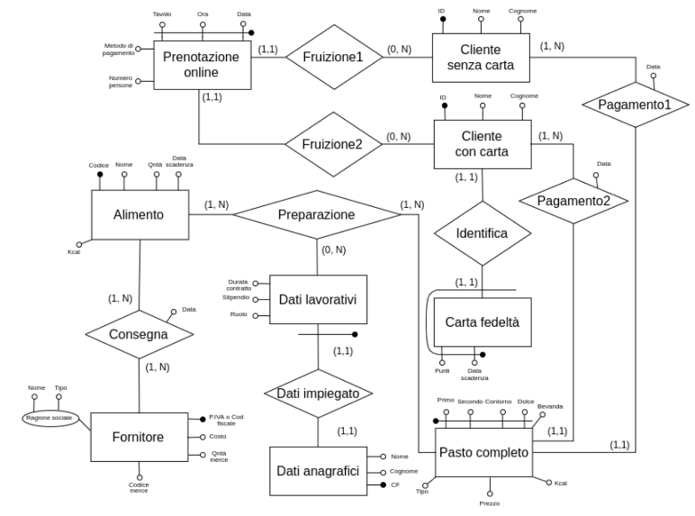

# database-mensa
Progetto per il corso di basi di dati

Nella relazione vengono spiegate le fasi di progettazione della base dati

La demo del progetto e' una webapp django collegata ad un database sqlite
i files forms.py, views.py sono estratti dal progetto 

